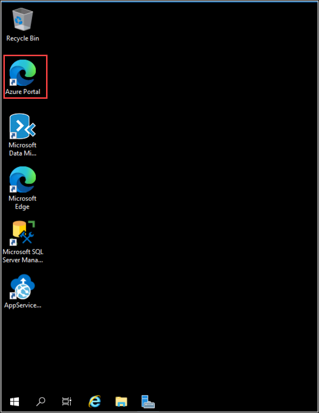
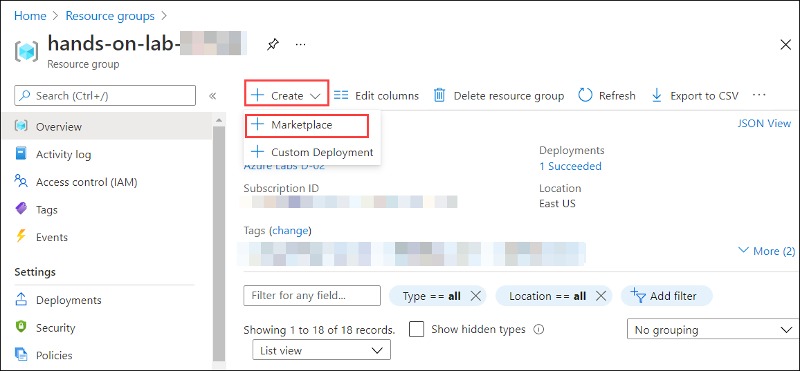
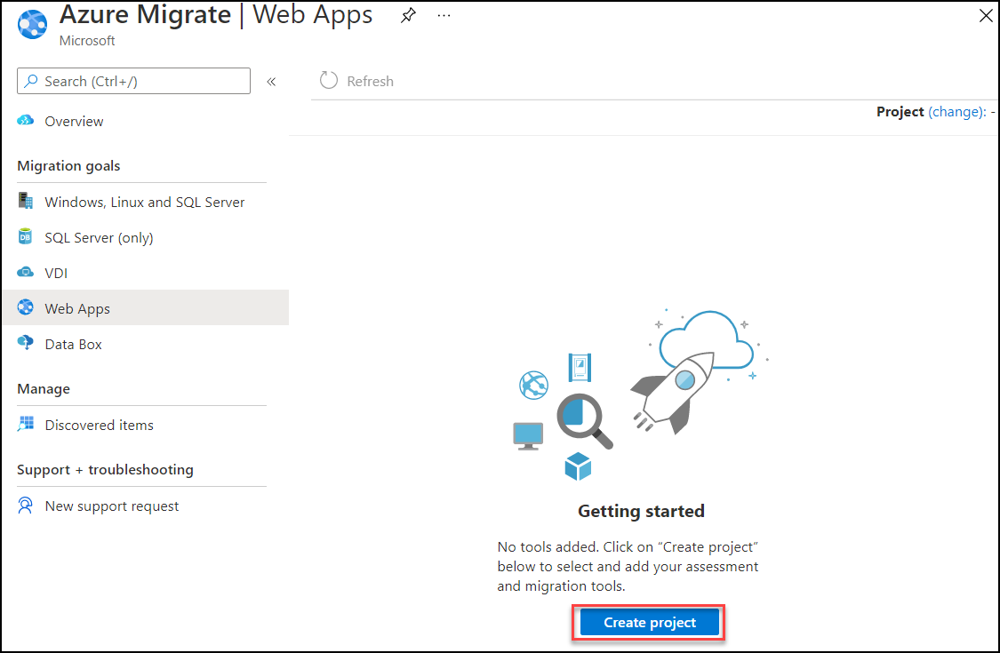
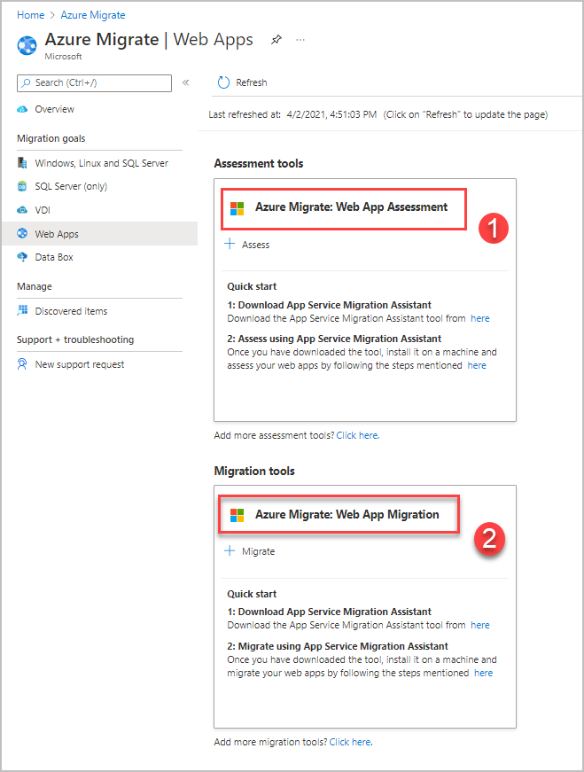
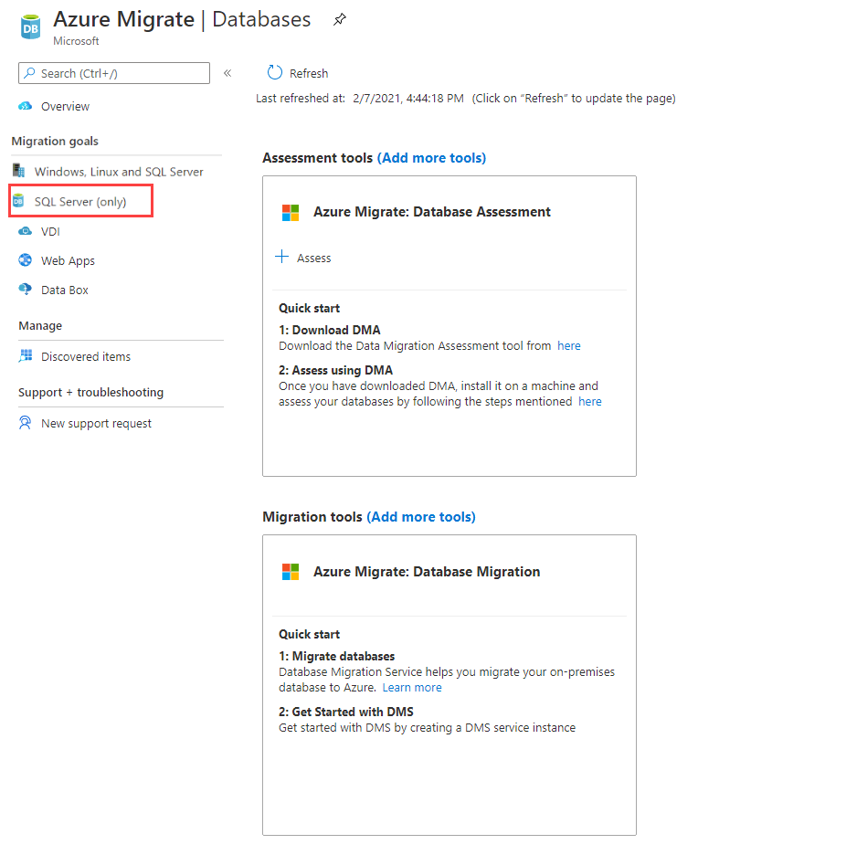

# Exercise 1: Setting up Azure Migrate

Duration: 10 minutes

Azure Migrate provides a centralized hub to assess and migrate on-premises servers, infrastructure, applications, and data to Azure . It provides a single portal to start, run, and track your migration to Azure. Azure Migrate comes with a range of tools for assessment and migration that we will use during our lab. We will use Azure Migrate as the central location for our assessment and migration efforts.

1. Default Browser - Make sure Edge is the default browser by navigating to Start>Settings>Default Apps as shown below

   

   

1. Open the **Azure portal** from the shortcut and log in to Azure. When prompted, use the credentials provided within the **Environment Details** tab of the lab guide.

    

1. Select your **resource group**. 

    

1. Select **Add** inside the resource group to add a new resource.

    

1. Type **Azure Migrate** into the search box and select **Azure Migrate** from the dropdown.

    

1. Select **Create** to continue.

    

1. As part of our migration project for Parts Unlimited, we will first assess and migrate their Web Application living on IIS, on a VM. Select **Web Apps** to continue.

    

1. Select **Create project**.

    

1. Type **partsunlimitedweb<inject key="DeploymentID" enableCopy="true"/>** as your project name. Select **Create** to continue. 

    

1. Once your project is created **Azure Migrate** will show you default **Web App Assessment (1)** and **Web App Migration (2)** tools (You might need to refresh your browser). For Parts Unlimited web site, **App Service Migration Assistant** is the one we have to use. Download links are presented in Azure Migrate's Web Apps page. In our case, our lab environment comes with App Service Migration Assistant pre-installed on Parts Unlimited's web server.

    

1. Another aspect of our migration project will be the database for Parts Unlimited's web site. We will have to assess the database's compatibility and migrate to Azure SQL Database. Let's switch to the **SQL Server(only) (1)** section in Azure Migrate. Select **Click here (2)** hyperlink for Assessment tools.

    

1. We will use **Azure Migrate: Database Assessment** to assess Parts Unlimited's database hosted on a SQL Server 2008 R2 server. Pick **Azure Migrate: Database Assessment (1)** and select **Add tool (2)**.

    

1. Now, we can see a download link for the **Data Migration Assessment (1)** tool under assessment tools in Azure Migrate. In our case, our lab environment comes with the Data Migration Assessment pre-installed on Parts Unlimited's database server. Select **Click here (2)** under the **Migration Tools** section to continue.

    

1. We will use **Azure Migrate: Database Migration** to migrate Parts Unlimited's database to an Azure SQL Database. Pick **Azure Migrate: Database Assessment (1)** and select **Add tool (2)**.

    

1. Now we have all the assessment and migration tools/services we need for Parts Unlimited ready to go under the Azure Migrate umbrella.

    
