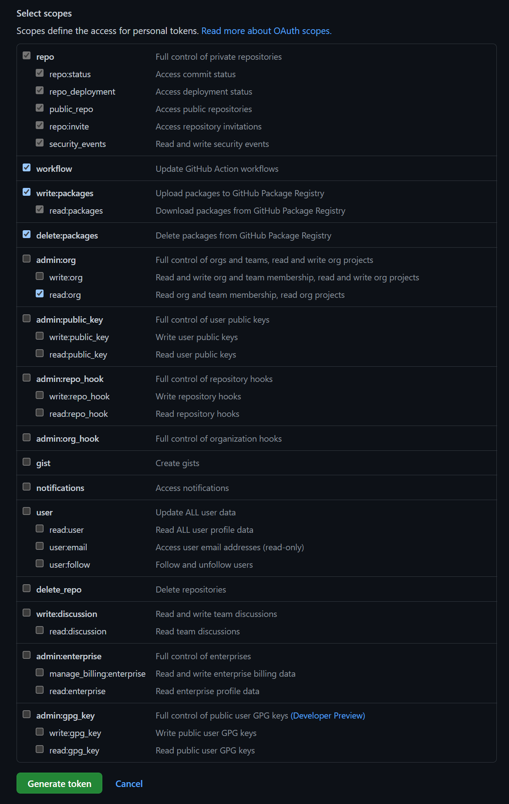
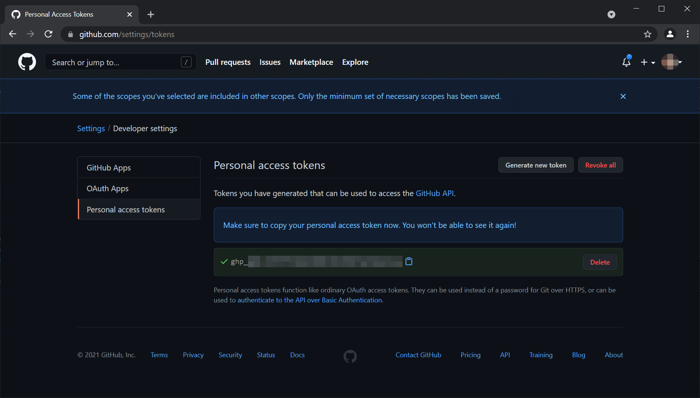
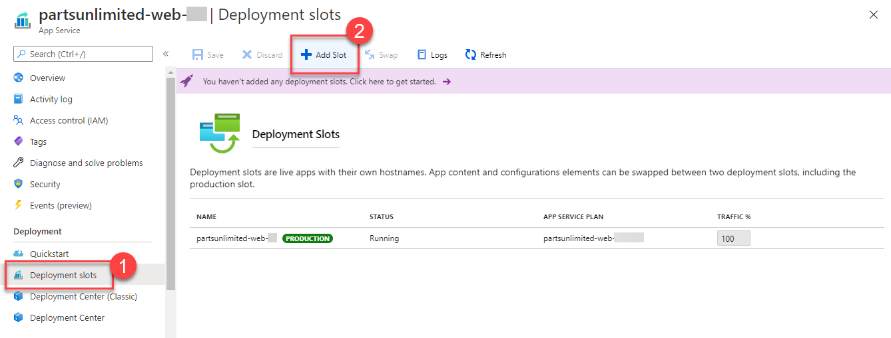
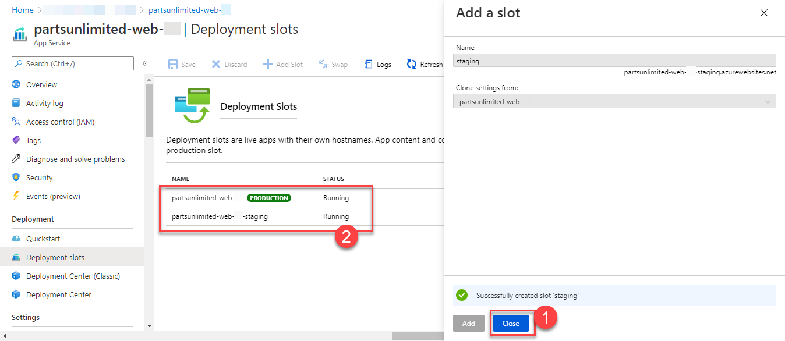
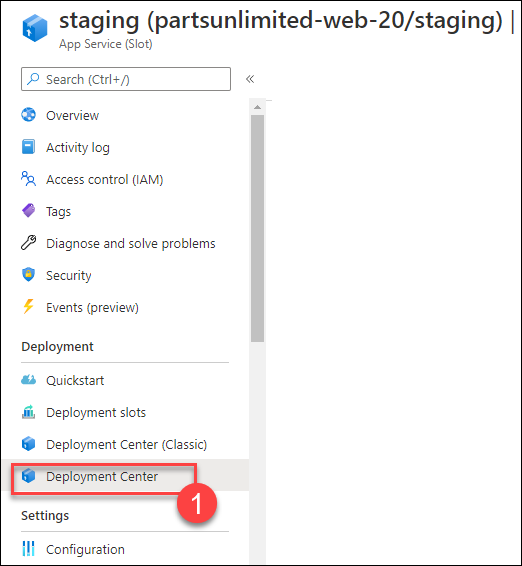
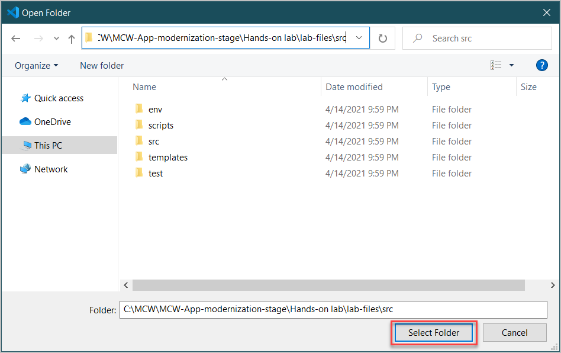
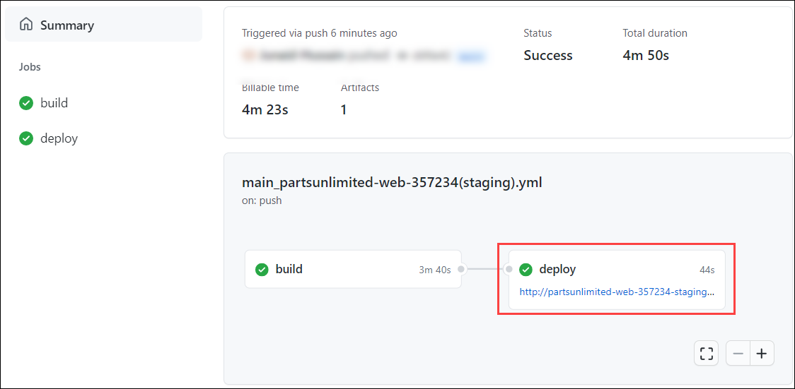
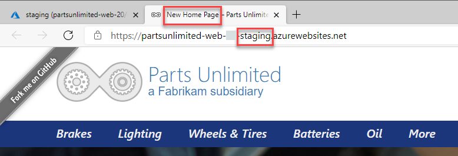
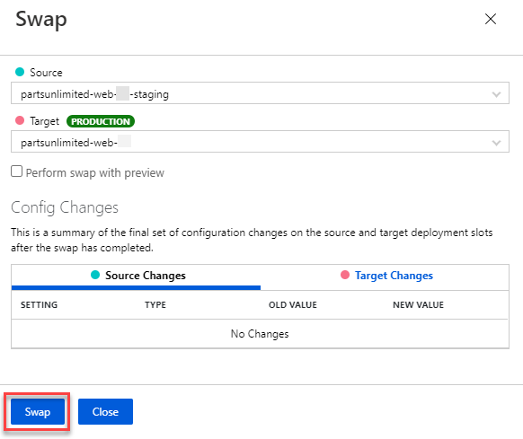

# Exercise 4: Setup CI/CD pipeline with GitHub Actions for the web app

Duration: 55 minutes

In this exercise, you will move the codebase to a GitHub Repo, create a staging environment in Azure App Service using App Service Deployment Slots, and finally connect the pieces with a CI/CD Pipeline built on GitHub Actions.

## Task 1: Moving the codebase to a GitHub repo

1. Browse to [GitHub](https://github.com) in your browser and log into your account.

   > NOTE!! If you don't have GitHub account, browse to [GitHub](https://github.com) in your browser and signup.

1. Create a Personal Access Token as [described here](https://docs.github.com/en/free-pro-team@latest/github/authenticating-to-github/creating-a-personal-access-token).  Ensure the following scopes are checked when configuring your GitHub Personal Access Token:

    - `repo` - Full control of private repositories
    - `workflow` - Update GitHub Action workflows
    - `write:packages` - Upload packages to GitHub Package Registry
    - `delete:packages` - Delete packages from GitHub Package Registry
    - `read:org` - Read org and team membership, read org projects

    

1. Copy the GitHub Personal Access Token somewhere safe and accessible for later use during the lab. **DO NOT COMMIT THIS VALUE TO YOUR REPO!**

    

1. Select the New button positioned on top of the repositories list. As an alternative you can [navigate to the new repository site here](https://github.com/new).

    

1. Type in `partsunlimited` **(1)** as your repository name. Select **Private (2)** to prevent public access to the repository. Select **Create repository (3)** to continue.

    

1. Select the **clipboard copy command** to copy the Git endpoint for your repository and paste the value into a text editor, such as Notepad.exe, for later reference.

    

    We will use the Lab VM to execute some development tasks.

1. Right-click on the Windows Start Menu and select **Windows PowerShell (Admin)** to launch a terminal window.

    

1. The Parts Unlimited website's source code is already copied into the VM as part of the **Before the hands-on lab exercises**. Run the command below to navigate to the source code folder.

    ```powershell
    cd "C:\MCW\MCW-App-modernization-stage\Hands-on lab\lab-files\src"
    ```

1. Run the following command to initialize a local Git repository.

    ```powershell
    git init
    ```

    

1. Next, we will define the remote endpoint as an origin to our local repository. Replace `{YourEndpointURL}` with the endpoint URL you copied previously from GitHub. Run the final command in your PowerShell terminal.

    ```powershell
    git remote add origin {YourEndpointURL}
    ```

    

1. Run the following commands to rename current branch to **Main** and add stage all the files for a git commit.

    ```powershell
    git branch -M main
    git add .
    ```

1. Before we commit our changes, we have to identify our git user name and e-mail. In the following command, replace `John Doe` with your name and `johndoe@example.com` with your e-mail address. Once ready, run the below commands in your PowerShell terminal.

    ```powershell
    git config --global user.name "John Doe"
    ```

    ```powershell
    git config --global user.email johndoe@example.com
    ```

1. We are ready to commit the source code to our local Git repository. Run the following command to continue.

    ```powershell
    git commit -m "Initial Commit"
    ```

1. Let's push our code to GitHub. Run the following command in your PowerShell terminal.

    ```powershell
    git push -u origin main
    ```

1. GitHub authentication screen will pop up. Provide **Personal Access Tocken** that you noted earlier and click on **Sign in**.

    > **NOTE**: Sometimes an authentication screen might not pop up, instead it might ask you to enter your credentials on Powershell itself.   
      
     > Fill-in your GitHub account with the following details to Sign-In from Powershell.
      
     > - **Username:**   Provide the GitHub Username
     > - **Password:**   Provide the **Personal Acess Tocken** that has been created during the starting of this Exercise

1. On the **Authorize Git Credential Manager** screen select **Authorize GotCredentialManager**. This will give your local environment permission to push the code to GitHub.

    

1. Close the browser.

1. Go back to GitHub and observe the repository with the source code uploaded.

    

## Task 2: Creating a staging deployment slot

1. Go back to your lab resource group, navigate to your **(2)  partsunlimited-web-<inject key="DeploymentID" enableCopy="false"/>**     
App Service resource. You can search for `partsunlimited-web` **(1)** to find your Web App and App Service Plan

   

1. Switch to the **Deployment slots (1)** tab and select **Add Slot (2)**.

    

1. Type in **staging** as the name **(1)** of the new slot. Select your app service name from the **Clone settings from (2)** dropdown list. This will ensure our web site configurations for the production environment are copied over to the staging environment as a starting point. Select **Add (3)** to add the new slot.

    

1. Once you receive the success message, close **(1)** the panel. Observe **(2)** the two environments we have for the App Service in the deployment slots list.

    

## Task 3: Setting up CI/CD with GitHub Actions

1. Select your staging slot from the list of deployment slots.

    

1. Switch to the **Deployment Center (1)** tab.

    

1. Select **GitHub (1)** as your source; **.NET (2)** as the runtime stack and **.NET Core 2.1 (LTS) (3)** for version. Select **Authorize** to create the connection between the App Service deployment slot and the GitHub repository we previously prepared.

    

   > **Note**: If you are not getting a drop down to select the desired .Net Version, you can follow the below instructions to select the desired verison of .Net Core.
     
    1. Select **Configuration** from the left-hand side menu then **General Settings**.

       

    2. On the **General settings** blade, provide the below information under **Stack settings** sections

        - Stack: Select **.Net** from the dropdown.
        - .NET version: Select **.NET Core(3.1,2.1)** from the dropdown.

        

    3. Click on **Save** then **Continue** to save the changes.

        
        
    4. Select **Overview** from the left-hand side menu and click on **Restart** to restart the app.

            

    5. Switch to the **Deployment Center** tab, select **GitHub** as the source and select **Authorize** to create the connection between the App Service deployment slot and the GitHub repository.
    
1. Login with your GitHub credentials and provide authorization to App Service to access the repository by selecting **Authorize AzureAppService**.

    

1. Once GitHub authorization is complete go back to the browser with the Azure Portal. Select the GitHub **Organization (1)** where you created the GitHub repository. This might be your personal account name if that is where you created the repository. Select the repository **partsunlimited (2)** and the branch **main (3)** as the source for the CI/CD pipeline. Select **Save (4)** to create CI/CD pipeline.

    > Note: Please refresh the page if you do not see your Github account linked even after authorizing the App service.
    
    

    Once you select **Save**, the portal will add your App Service publishing profile as a secret to your GitHub repository. This will allow GitHub Actions to publish the Parts Unlimited web site to the staging deployment slot. Additionally, the portal will create a YAML file that describes the steps required to build and publish the code in the partsunlimited repository.
    > Note: If you get an error `Failed to set up deployment: Cannot find User with name xxxxyyy`. this is expected. ignore to continue with the next steps below.

1. Visit your GitHub repository on GitHub.com to look for changes. Navigate to `.github/workflows` **(1)** to see the **YAML file (2)** and the commit **(3)** made to the repository on your behalf.

    

1. Select **Actions (1)** to navigate to the Actions page where you can see the list of workflow runs on the repository. Noticed that the latest run has failed **(2)**. Select the failed run (2) to investigate the issue.

    

1. Select the failed job to dig deeper.

    

1. In the error message, we can see a mismatch between the .NET Core version the build job is using and the one the project is built against. When we set up our CI/CD pipeline, the Azure Portal listed .NET Core LTS (Long Term Support) versions only. Unfortunately, Parts Unlimited uses a .NET Core version that hit the end of life on December 23, 2019. We will have to change our pipeline setup manually to accommodate project requirements.

    

1. Select **Code (1)** to switch back to the repository code view. Select **.github/workflows (2)** to navigate to the location where the workflow YAML code is stored.

    

1. Select the YAML file name `main_partsunlimited-web-20(staging).yml`.

    

1. Select the **Edit this file (1)** button to modify the YAML file.

    

1. We have to change the **dotnet-version (1)** number to `2.2.207`. Additionally, we have to add the solution file name **(2)** **PartsUnlimited.sln**  and the project file name **(3)** **src/PartsUnlimitedWebsite/PartsUnlimitedWebsite.csproj**  to dotnet build and publish commands. The reason behind this change is the fact that Parts Unlimited has multiple solutions and projects in their codebase. Name the commit as **CI/CD Definition Update**.

    

    Below is the final YAML file for illustration.
    >Note: Do not copy the below code to the file. The secret file reference will not work.

    ```yaml
    
    # Docs for the Azure Web Apps Deploy action: https://github.com/Azure/webapps-deploy
    # More GitHub Actions for Azure: https://github.com/Azure/actions
    
    name: Build and deploy ASP.Net Core app to Azure Web App - partsunlimited-web-20(staging)
    
    on:
    push:
        branches:
        - main
    workflow_dispatch:
    
    jobs:
    build-and-deploy:
        runs-on: windows-latest
    
        steps:
        - uses: actions/checkout@master
    
        - name: Set up .NET Core
        uses: actions/setup-dotnet@v1
        with:
            dotnet-version: '2.2.207'
    
        - name: Build with dotnet
        run: dotnet build PartsUnlimited.sln --configuration Release
    
        - name: dotnet publish
        run: dotnet publish src/PartsUnlimitedWebsite/PartsUnlimitedWebsite.csproj -c Release -o ${{env.DOTNET_ROOT}}/myapp
    
        - name: Deploy to Azure Web App
        uses: azure/webapps-deploy@v2
        with:
            app-name: 'partsunlimited-web-20'
            slot-name: 'staging'
            publish-profile: ${{ secrets.AzureAppService_PublishProfile_a00d49c7adc84a028ccc74ff431024d5 }}
            package: ${{env.DOTNET_ROOT}}/myapp
    ```

1. Once all changes are complete select **Start commit (1)**. Type a commit message **(2)**. Select **Commit changes (3)** to submit your changes to the repository.

    

1. Select **Actions (1)** to switch to the workflows page. Notice the latest successful run **(2)** of our workflow.

    

1. Go back to your lab resource group on the Azure Portal, navigate to your **(2)  staging (partsunlimited-web-<inject key="DeploymentID" enableCopy="false"/>/staging)**   
App Service resource. You can search for `staging` **(1)** to find your App Service (Slot) for staging.

    

1. Notice the dedicated web link for your staging slot. Select to navigate to the web site to see the result of your successful deployment through the CI/CD pipeline.

    

## Task 4: Pushing code changes to staging and production

1. Select the Start menu and search for **Visual Studio Code**. Select **Visual Studio Code** to run it.

    

1. Open the **File (1)** menu and select **Open Folder... (2)**.

    

1. Navigate to `C:\MCW\MCW-App-modernization-stage\Hands-on lab\lab-files\src` and select **Select Folder (1)**.

    

1. Select **Source Control (1)** tab in Visual Studio Code. Since we worked on the codebase in our repo in the virtual machine, the codebase in the repo on GitHub has changed. Open the **Views and more actions... (2)** menu and select **Pull (3)** to get the latest from the remote repository.

    

1. Now that our codebase has been updated, we are going to introduce a brand new change to Parts Unlimited's web site. In the Explorer window navigate to **src > PartsUnlimitedWebSite > Views > Home** and select **Index.cshtml (4)** for editing. Change the Title of the page **(5)** and save the file by using going to the File menu and selecting **Save**. Notice the underlying git repository detecting a change (6) in the codebase.

    

1. Select **Stage Changes (1)**. Type in a commit message **(2)** for the changes. Select **Commit (3)**.

    

1. Open the **Views and more actions... (1)** menu and select **Push (2)** to push the changes to GitHub.

    

1. Open the GitHub repository and observe the Actions page for the latest execution of the CI/CD Pipeline.

    
    
1. Navigate to the staging environment endpoint by clicking on the link under **deploy**.

    

1. Observe the Title change.

    

Now that Parts Unlimited has a separate staging environment for their e-commerce site, they can push new source code and functionality to the repo that will automatically be built and deployed to their staging for testing.

## Task 5: Swap deployment slots to move changes in staging to production

Once Parts Unlimited is happy with the changes tested in their staging environment, they can swap the two environments and have changes go to production. Environment Swap happens very fast and can help Parts Unlimited pull back changes by switching back if needed.

1. Go back to your lab resource group, navigate to your **(2)  partsunlimited-web-<inject key="DeploymentID" enableCopy="false"/>**     
App Service resource. You can search for `partsunlimited-web` **(1)** to find your app service.

   

1. Switch to the **Deployment slots (1)** tab and select **Swap (2)**.

    

1. Select the **Swap** button to swap the staging slot with the production slow.

    

1. Once you receive the success message, close the swap panel.

1. Visit both production and staging slot endpoints and observe how the Title change is moved to production.

    > Once you move your staging slot to production, your production slot is moved to staging as well. This means that your current staging slot does not have the latest changes you have pushed to the repo. You can trigger a manual CI/CD workflow execution to push the latest changes to staging.
    >
    > To run a CI/CD workflow manually, go to GitHub actions page **(1)** in your repository. Select the workflow **(2)** to run. Open the **Run workflow (3)** menu and select **Run workflow (4)**.
    >
    > 
